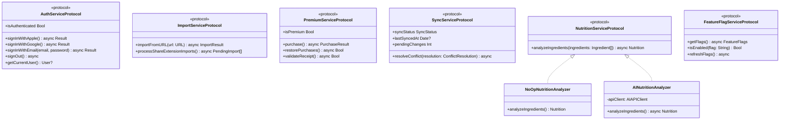

## References

| Ref | Title | Version | Date |
|-----|-------|---------|------|
| [1] | ClipCook SRS (docs/SRS.md) | 0.1 | 2026-02-19 |
| [2] | ClipCook UI Prototype Screenshots | — | 2026-02-19 |
| [3] | Apple Human Interface Guidelines — iOS 17 | — | — |
| [4] | Firebase Documentation | — | — |
| [5] | Apple StoreKit 2 Documentation | iOS 17+ | — |

---

# 1. Introduction & Goals

## 1.1 System Purpose

ClipCook is an iOS application that enables users to capture recipes from social media (primarily Instagram), organise them into a personal collection, plan meals, and follow step-by-step cooking guidance. The architecture supports an MVP without AI, with a clear upgrade path to AI-powered features gated behind premium subscriptions.

## 1.2 Quality Goals

| Priority | Quality Goal | Scenario |
|----------|-------------|----------|
| 1 | Offline-first reliability | User edits a recipe while cooking without internet; data persists and syncs later |
| 2 | Responsive UI | All screen transitions and list scrolling maintain 60fps |
| 3 | Security & Privacy | No cross-user data access; no PII in logs; GDPR compliance |
| 4 | Extensibility | AI features can be added behind feature flags without modifying core architecture |
| 5 | Testability | ViewModels and Services are protocol-based and unit-testable |

## 1.3 Stakeholders

| Stakeholder | Concern |
|-------------|---------|
| End Users | Fast, reliable recipe management; offline cooking support |
| Product Owner | Feature velocity; premium conversion; App Store approval |
| iOS Developers | Clean architecture; testability; clear module boundaries |
| QA Team | Automated testing; reproducible states |
| Security Officer | Data isolation; encryption; no credential leakage |
| Operations | Monitoring; deployment simplicity; autoscaling |

---

# 2. Architecture Constraints

| Constraint | Description |
|------------|-------------|
| Platform | iOS 17+ (SwiftUI), App Store distribution |
| Language | Swift 5.9+ |
| UI Framework | SwiftUI (declarative) |
| Backend | Firebase Authentication + Cloud Firestore |
| Payments | Apple IAP (StoreKit 2) — mandatory for digital subscriptions |
| AI Hosting | Azure GPT-4x, customer-hosted; keys never in client |
| Compliance | GDPR, Apple App Store Guidelines, WCAG AA |
| Offline | App must be fully functional offline (offline-first) |
| Share Extension | Must share data with main app via App Group |

---

# 3. System Context (C4 Level 1)

The system context diagram shows ClipCook and all external actors and systems it interacts with.


**External system responsibilities:**

- **Firebase Auth + Firestore**: User identity, persistent document storage, offline cache, security rules
- **Metadata Server** (optional): Extracts og:title, og:image, og:description from social media URLs
- **AI Service** (optional, premium): Recipe parsing, nutrition analysis, video-to-recipe
- **Apple IAP**: Subscription management, receipt validation
- **Instagram / Social Media**: Source of recipe content (URLs)

---

# 4. Container Diagram (C4 Level 2)


**Container descriptions:**

| Container | Technology | Responsibility |
|-----------|-----------|----------------|
| iOS App | SwiftUI, Swift 5.9+ | Main application: all screens, business logic, offline persistence |
| Share Extension | SwiftUI | Accepts shared URLs, writes to App Group storage |
| App Group Store | UserDefaults + FileManager | Shared data container between app and extension |
| Local Cache | Firestore offline persistence | Offline-first data access and automatic sync |
| Firebase Auth | Firebase SDK | User authentication (Apple, Google, Email) |
| Cloud Firestore | Firebase SDK | Document database with real-time sync |
| Cloud Functions | Node.js | Server-side receipt validation, AI proxy |
| Crashlytics | Firebase SDK | Crash and error reporting |
| Metadata Server | Express.js / Docker | URL metadata extraction (og:tags) |
| AI Endpoint | Azure Functions | Recipe parsing, nutrition analysis |
| Apple IAP | StoreKit 2 | Subscription purchase and restore |

---

# 5. Component Diagram (C4 Level 3)

The iOS App is structured using a clean MVVM architecture with a service layer and repository pattern.


**Module mapping to UI screenshots:**

| Module | Screenshots | SRS Reference |
|--------|-----------|---------------|
| Onboarding | [01-onboarding-slide1.png](assets/01-onboarding-slide1.png), [01-onboarding-slide2.png](assets/01-onboarding-slide2.png), [01-onboarding-slide3.png](assets/01-onboarding-slide3.png) | PUC/001 |
| Authentication | [02-signin.png](assets/02-signin.png) | PUC/001, SYS/007 |
| Home / Browse | [03-home.png](assets/03-home.png) | PUC/002, SYS/002 |
| Import | [04-import.png](assets/04-import.png), [04-import-success.png](assets/04-import-success.png), [04-import-failed.png](assets/04-import-failed.png) | PUC/003, SYS/003 |
| Recipe Detail | [05-recipe-detail.png](assets/05-recipe-detail.png) | PUC/004, SYS/004 |
| Recipe Edit | [06-recipe-edit.png](assets/06-recipe-edit.png) | PUC/005, SYS/005 |
| Cook Mode | [07-cook-mode.png](assets/07-cook-mode.png) | PUC/006, SYS/006 |
| Shopping List | [08-shopping.png](assets/08-shopping.png), [08-shopping-filled.png](assets/08-shopping-filled.png) | PUC/007, SYS/008 |
| Meal Planner | [09-planner.png](assets/09-planner.png), [09-planner-add-meal.png](assets/09-planner-add-meal.png), [09-planner-with-meal.png](assets/09-planner-with-meal.png), [09-planner-premium.png](assets/09-planner-premium.png) | PUC/008, SYS/009 |
| Settings | [10-settings.png](assets/10-settings.png), [10-settings-premium.png](assets/10-settings-premium.png) | PUC/010, SYS/012 |
| Archived Recipes | [11-archived-recipes.png](assets/11-archived-recipes.png) | PUC/011, SYS/013 |

---

# 6. Class Diagrams

## 6.1 Core Domain Models


## 6.2 Repository Protocols


## 6.3 Service Layer



---

# 7. Sequence Diagrams

## 7.1 Recipe Import Flow (Success + Failure)


**Visual reference:** [04-import.png](assets/04-import.png) (initial), [04-import-success.png](assets/04-import-success.png) (success preview), [04-import-failed.png](assets/04-import-failed.png) (failure state)

## 7.2 Share Extension to Main App


## 7.3 Recipe CRUD with Offline Sync


**Visual reference:** [06-recipe-edit.png](assets/06-recipe-edit.png) (edit form), [05-recipe-detail.png](assets/05-recipe-detail.png) (detail after save)

## 7.4 Premium Subscription Purchase


**Visual reference:** [10-settings.png](assets/10-settings.png) (before purchase), [10-settings-premium.png](assets/10-settings-premium.png) (after purchase with nutrition goals), [09-planner-premium.png](assets/09-planner-premium.png) (macro tracker unlocked)

## 7.5 Authentication Flow (Sign in with Apple)


**Visual reference:** [02-signin.png](assets/02-signin.png) (sign-in screen), [03-home.png](assets/03-home.png) (home after successful auth)

## 7.6 Cook Mode Step Navigation


**Visual reference:** [07-cook-mode.png](assets/07-cook-mode.png) (step-by-step interface)

## 7.7 Meal Planning Flow


**Visual reference:** [09-planner.png](assets/09-planner.png) (empty), [09-planner-add-meal.png](assets/09-planner-add-meal.png) (picker), [09-planner-with-meal.png](assets/09-planner-with-meal.png) (meal added)

## 7.8 Sync Conflict Resolution


---

# 8. Data Architecture

## 8.1 Firestore Document Structure

```
users/
  {userId}/
    ├── email: string
    ├── displayName: string
    ├── units: "metric" | "imperial"
    ├── darkMode: boolean
    ├── isPremium: boolean
    ├── schemaVersion: number
    ├── nutritionGoals: { calories, protein, carbs, fats }
    ├── flags: { ai_enabled, ai_recipe_parsing, ... }
    ├── createdAt: timestamp
    ├── updatedAt: timestamp
    │
    ├── recipes/
    │     {recipeId}/
    │       ├── title, thumbnail, sourceUrl, sourcePlatform
    │       ├── caption, prepTime, cookTime, servings, category
    │       ├── ingredients: [{ id, name, amount, notes }]
    │       ├── steps: [{ id, order, text }]
    │       ├── nutrition: { calories, protein, carbs, fats } | null
    │       ├── aiMeta: { enabled, modelVersion, lastRun } | null
    │       ├── isArchived, isFavourite
    │       └── createdAt, updatedAt
    │
    ├── shoppingItems/
    │     {itemId}/
    │       ├── name, recipeId, recipeName, checked
    │       └── createdAt
    │
    ├── mealSlots/
    │     {slotId}/
    │       ├── day: "yyyy-MM-dd"
    │       ├── meal: MealType
    │       ├── recipeId | null
    │       ├── quickAdd: { name, calories, protein, carbs, fats } | null
    │       └── createdAt
    │
    └── pendingImports/
          {importId}/
            ├── url, status, title, thumbnail, caption
            └── createdAt
```

## 8.2 Local Persistence Strategy

| Layer | Technology | Purpose |
|-------|-----------|---------|
| Primary | Firestore offline persistence | Automatic local cache; transparent sync |
| App Group | UserDefaults + JSON files | Share Extension ↔ Main App data exchange |
| Image Cache | URLCache / NSCache | Recipe thumbnail caching |

**Offline-first flow:**

1. All reads go to the local Firestore cache first (instant)
2. Writes persist to local cache immediately
3. Firestore SDK handles background sync when connectivity is available
4. Pending writes survive app termination

## 8.3 Offline-First Sync Pattern


---

# 9. API Contracts

## 9.1 Metadata Endpoint (Optional)

```
GET /metadata?url={encoded_url}

Response 200:
{
  "title": "Creamy Tuscan Chicken Pasta",
  "image": "https://example.com/image.jpg",
  "description": "A delicious pasta recipe...",
  "source": "instagram",
  "cached": false
}

Response 408 (timeout after 7s):
{
  "error": "timeout",
  "message": "Could not fetch metadata within timeout"
}

Response 422 (unsupported URL):
{
  "error": "unsupported_url",
  "message": "URL format not recognized"
}
```

## 9.2 AI Analyze Endpoint (Optional, Premium)

```
POST /ai/analyze-recipe

Headers:
  Authorization: Bearer {firebase_id_token}
  Content-Type: application/json

Body:
{
  "userId": "uid_123",
  "recipeId": "recipe_456",
  "text": "ingredients and steps text...",
  "source": "instagram"
}

Preconditions:
  - user.flags.ai_recipe_parsing === true
  - user.isPremium === true

Response 200:
{
  "title": "Creamy Tuscan Chicken Pasta",
  "ingredients": [
    { "name": "Chicken breast", "qty": "500", "unit": "g" }
  ],
  "steps": [
    { "order": 1, "text": "Cook pasta according to package directions." }
  ],
  "nutrition": {
    "kcal_total": 580,
    "kcal_per_serving": 145,
    "protein_g": 42,
    "carbs_g": 55,
    "fat_g": 22
  },
  "modelVersion": "gpt-4x-2025-01"
}

Response 403:
{
  "error": "premium_required",
  "message": "User does not have active premium subscription"
}
```

## 9.3 Firestore Security Rules

```javascript
rules_version = '2';
service cloud.firestore {
  match /databases/{database}/documents {

    match /users/{userId} {
      allow read, write: if request.auth != null
                         && request.auth.uid == userId;

      match /recipes/{recipeId} {
        allow read, write: if request.auth != null
                           && request.auth.uid == userId;
      }

      match /shoppingItems/{itemId} {
        allow read, write: if request.auth != null
                           && request.auth.uid == userId;
      }

      match /mealSlots/{slotId} {
        allow read, write: if request.auth != null
                           && request.auth.uid == userId;
      }

      match /pendingImports/{importId} {
        allow read, write: if request.auth != null
                           && request.auth.uid == userId;
      }
    }
  }
}
```

## 9.4 Deep Link Schema

```
clipcook://imports          → Navigate to Import screen, process pending imports
clipcook://recipe/{id}      → Navigate to Recipe Detail for given ID
clipcook://settings         → Navigate to Settings
```

---

# 10. Security Architecture

## 10.1 Authentication


- Firebase Auth handles all identity provider integrations
- ID tokens stored in iOS Keychain (encrypted at rest)
- Tokens refreshed automatically by Firebase SDK
- Sign in with Apple required by App Store guidelines when offering social sign-in

## 10.2 Authorization Model

| Layer | Mechanism | Scope |
|-------|-----------|-------|
| Client | Feature flags check | UI gating of premium features |
| Client | Authentication state | All authenticated-only screens |
| Firestore | Security rules | Document-level access control (`auth.uid == userId`) |
| Cloud Functions | ID token verification | Server-side API authorization |
| AI Endpoint | Token + flag verification | Premium-only API access |

## 10.3 Data Protection

| Data | At Rest | In Transit |
|------|---------|------------|
| User credentials | iOS Keychain (hardware encrypted) | TLS 1.2+ |
| Firestore data | AES-256 (Firebase default) | TLS 1.2+ |
| App Group data | iOS file protection | Local only (no transit) |
| API keys | Never in client; Cloud Functions environment variables | TLS 1.2+ |
| Purchase receipts | StoreKit 2 (signed by Apple) | TLS 1.2+ |

## 10.4 Receipt Validation Flow


---

# 11. Deployment Architecture

## 11.1 Overview


## 11.2 CI/CD Pipeline


## 11.3 Environment Configuration

| Environment | Firebase Project | Metadata Server | AI Endpoint | Distribution |
|-------------|-----------------|-----------------|-------------|--------------|
| Development | clipcook-dev | localhost:3000 | Mock/disabled | Xcode |
| Staging | clipcook-staging | staging.meta.clipcook.app | staging AI endpoint | TestFlight |
| Production | clipcook-prod | meta.clipcook.app | prod AI endpoint | App Store |

Each environment uses a separate `GoogleService-Info.plist` selected at build time via Xcode build configurations.

---

# 12. Cross-Cutting Concerns

## 12.1 Feature Flags Architecture

```mermaid
graph TB
    subgraph client [iOS App]
        FlagService[FeatureFlagService]
        FlagCache[Local Flag Cache]
        ViewModels[ViewModels<br>check flags]
        Views[SwiftUI Views<br>conditional rendering]
    end

    subgraph server [Firebase]
        UserDoc[users/{id}/flags]
        RemoteConfig[Remote Config<br>optional]
    end

    FlagService --> FlagCache
    FlagService --> UserDoc
    FlagService --> RemoteConfig
    ViewModels --> FlagService
    Views --> ViewModels
```

**Flag evaluation order:**
1. Local cache (instant, stale)
2. User document flags (authoritative)
3. Remote Config (global overrides, optional)

**Default flag values (MVP):**

| Flag | Default | Premium |
|------|---------|---------|
| ai_enabled | false | true |
| ai_recipe_parsing | false | true |
| ai_nutrition_analysis | false | true |
| ai_video_to_recipe | false | true |
| ai_meal_planner | false | true |
| share_extension_enabled | true | true |

## 12.2 Error Handling Strategy

| Layer | Strategy | User Feedback |
|-------|----------|---------------|
| Network | Retry with exponential backoff (max 3 attempts) | Loading indicator → fallback / error card |
| Import | Graceful degradation (metadata server optional) | Error card with "Try Again" / "Edit Manually" |
| Sync | Queue for retry; surface conflicts | Sync status badge; conflict resolution modal |
| Purchase | StoreKit error handling; receipt retry | Error alert with retry option |
| AI | NoOpAnalyzer fallback when unavailable | Silent fallback (zero values) |
| Crash | Crashlytics capture; non-blocking | App recovers gracefully; no data loss |

## 12.3 Logging & Monitoring

| Component | Tool | Data |
|-----------|------|------|
| iOS App crashes | Firebase Crashlytics | Stack traces, device info (no PII) |
| iOS App analytics | Firebase Analytics (optional) | Screen views, feature usage |
| Server logs | Structured JSON (Cloud Logging) | Request/response, errors (no PII) |
| Audit trail | Firestore collection | Action type, timestamp, user ID |
| Performance | Xcode Instruments / Firebase Performance | Launch time, screen load, network latency |

## 12.4 Accessibility Approach

| Aspect | Implementation |
|--------|---------------|
| Dynamic Type | All text uses SwiftUI `.font()` modifiers that scale with system settings |
| VoiceOver | All interactive elements have `.accessibilityLabel()` and `.accessibilityHint()` |
| Tap Targets | Minimum 44x44pt for all interactive elements |
| Contrast | WCAG AA compliance (4.5:1 normal, 3:1 large text) verified with Accessibility Inspector |
| Reduced Motion | `@Environment(\.accessibilityReduceMotion)` used to disable animations; all `withAnimation` calls wrapped in a `reduceMotion` guard that substitutes a simple `.opacity` transition |
| Colour Blindness | No information conveyed solely by colour; icons and text always accompany colour indicators |

## 12.5 Screen Wake Lock (Cook Mode)

When the user enters Cook Mode, the app sets `UIApplication.shared.isIdleTimerDisabled = true` to prevent the screen from dimming or locking. The flag is restored to `false` when Cook Mode is exited — either by completing the recipe, pressing "Exit Cook Mode", or when the view's `onDisappear` fires (app backgrounding safety net).

```swift
// CookModeView.swift
.onAppear {
    UIApplication.shared.isIdleTimerDisabled = true
}
.onDisappear {
    UIApplication.shared.isIdleTimerDisabled = false
}
```

## 12.6 Local Notifications (Timers & Meal Reminders)

```mermaid
sequenceDiagram
    participant User
    participant CookModeVM as CookModeViewModel
    participant NotifService as NotificationService
    participant UNCenter as UNUserNotificationCenter

    User->>CookModeVM: Start step timer
    CookModeVM->>NotifService: scheduleTimerNotif(stepIndex, seconds)
    NotifService->>UNCenter: add(UNNotificationRequest)
    Note over UNCenter: fires when timer completes<br>(even if app backgrounded)
    UNCenter-->>User: Banner / sound notification
    User->>CookModeVM: Return to app
    CookModeVM->>NotifService: cancelTimerNotif(stepIndex)
```

**Implementation notes:**
- Uses `UNUserNotificationCenter` with `UNTimeIntervalNotificationTrigger`.
- Notification permission requested on first Cook Mode entry or first meal plan creation.
- Meal plan reminders use `UNCalendarNotificationTrigger` for recurring date/time alerts.

## 12.7 Image Optimisation Pipeline

| Stage | Strategy |
|-------|----------|
| Upload | Client-side compression (HEIF/JPEG, max dimension 1200px, quality 0.8, target < 1MB) before uploading to Firebase Storage |
| Grid thumbnails | Firebase Storage extension generates 400px-wide thumbnails on upload; Home grid loads only thumbnails |
| Detail view | Full-resolution image (up to 1200px) loaded on demand with `AsyncImage` progressive loading |
| Caching | `URLCache` with 100MB disk limit for images; LRU eviction; offline-capable |
| Placeholder | Blurred hash placeholder (BlurHash) shown while images load |

## 12.8 App Binary Size Management

| Technique | Detail |
|-----------|--------|
| Asset Catalogs | All images in Asset Catalogs enabling App Thinning (per-device delivery) |
| On-Demand Resources | Non-essential assets (onboarding illustrations, seasonal themes) tagged as ODR |
| Dependencies | Minimise third-party SPM packages; prefer Foundation / SwiftUI built-ins |
| Build Settings | `DEAD_CODE_STRIPPING = YES`; bitcode disabled (Xcode 16+ default); link-time optimisation enabled |
| CI Gate | Archive build step logs thin binary size; PR blocked if delta > 2MB |

## 12.9 Localisation Architecture

All user-facing strings are managed via Xcode String Catalogs (`.xcstrings`).

| Component | Approach |
|-----------|----------|
| UI strings | `String(localized:)` macro / `LocalizedStringKey` in SwiftUI views |
| Plural rules | String Catalog stringsdict variant sets |
| Date/Number formatting | `Date.FormatStyle`, `Decimal.FormatStyle` with `Locale.current` |
| Server content | Recipe text stored in user-authored language; no server-side translation |
| RTL support | SwiftUI `.flipsForRightToLeftLayoutDirection(true)` on custom layouts |
| Initial locale | English (en); additional locales added by dropping translated `.xcstrings` files with no code changes |

---

# 13. Technology Stack

| Category | Technology | Rationale |
|----------|-----------|-----------|
| Language | Swift 5.9+ | Modern, type-safe, required for iOS |
| UI Framework | SwiftUI | Declarative UI, iOS 17+ features (Observable macro) |
| Architecture | MVVM + Repository + Service Layer | Testable, separation of concerns |
| Dependency Injection | Swift Package Protocols | Lightweight; no third-party DI framework needed |
| Backend Auth | Firebase Authentication | Multi-provider (Apple, Google, Email); free tier |
| Database | Cloud Firestore | Offline persistence; real-time sync; document model fits recipe data |
| Payments | StoreKit 2 | Required by Apple; modern async API |
| Subscription Management | RevenueCat (optional) | Cross-platform convenience; webhook support |
| Crash Reporting | Firebase Crashlytics | Free; integrates with Firebase ecosystem |
| CI/CD | Xcode Cloud or GitHub Actions | Build, lint, test automation |
| Linting | SwiftLint | Code consistency enforcement |
| Image Loading | SwiftUI AsyncImage + URLCache (100MB) + BlurHash placeholder | Native; efficient thumbnail pipeline (see 12.7) |
| Animations | SwiftUI built-in + `withAnimation` (reduce-motion aware) | Native performance; accessibility-safe (see 12.4) |
| Date Handling | Foundation `Date.FormatStyle`, `Calendar` (locale-aware) | Native; supports localisation (see 12.9) |
| Notifications | UNUserNotificationCenter (local) | Cook-mode timers & meal reminders (see 12.6) |
| Localisation | Xcode String Catalogs (`.xcstrings`) | Zero hard-coded strings; additive locale support (see 12.9) |
| Metadata Server | Express.js + Docker | Lightweight; easy to deploy; containerised |
| AI Service | Azure GPT-4x via Azure Functions | Customer-hosted; secure; serverless scaling |
| Testing | XCTest + Swift Testing | Unit tests for ViewModels; UI tests for flows |

---

# 14. Risks & Technical Debt

## 14.1 Architectural Risks

| Risk | Impact | Likelihood | Mitigation |
|------|--------|------------|------------|
| Firestore offline sync edge cases (large datasets, prolonged offline) | Data loss or stale data | Medium | Implement conflict detection; limit offline cache size; test with airplane mode |
| Share Extension memory limits (iOS enforces 120MB) | Extension crash on large payloads | Low | Keep extension minimal; process data in main app |
| StoreKit 2 edge cases (sandbox testing differences from production) | Purchase flow bugs | Medium | Extensive TestFlight testing; RevenueCat as fallback |
| Firestore query limitations (no full-text search) | Poor search experience at scale | Medium | Client-side search for MVP; consider Algolia for future |
| AI service latency (Azure GPT-4x) | Slow nutrition auto-fill | Low | Show loading indicator; timeout after 15s; NoOpAnalyzer fallback |

## 14.2 Known Technical Debt

| Item | Description | Priority | Plan |
|------|-------------|----------|------|
| In-memory state (prototype) | Current React prototype stores all state in-memory; iOS version must implement persistence | Critical | Implement Firestore integration in Sprint 0 |
| Mock authentication | Prototype has no real auth; iOS needs Firebase Auth | Critical | Sprint 0 |
| No image storage | Prototype uses external URLs; need Firebase Storage or on-device storage | High | Sprint 1 |
| Nutrition DB is static | Mock nutrition data; need AI integration or external API | Medium | Premium feature sprint |
| No export functionality | SRS specifies recipe/list export; not in prototype | Low | Post-MVP |
| No deep link handling | Deep link schema defined but not implemented in prototype | Low | Sprint 2 |

## 14.3 Scalability Considerations

| Concern | Current Approach | Future Approach |
|---------|-----------------|-----------------|
| Recipe collection size | Client-side filtering up to ~100 recipes | Server-side pagination + Algolia search |
| Image storage | External URLs | Firebase Storage with CDN + thumbnails |
| Meal plan history | All slots in sub-collection | Archival of slots older than 90 days |
| Concurrent users | Firebase free tier | Firebase Blaze plan with scaling |
| AI requests | Direct calls | Queue-based with Cloud Tasks for rate management |

---

# Appendix A: Screen-to-Architecture Mapping

This mapping connects each UI screen (as shown in the prototype screenshots) to the architectural components responsible for rendering and logic.

| Screenshot | View | ViewModel | Services | Repository |
|-----------|------|-----------|----------|------------|
| [01-onboarding-slide1.png](assets/01-onboarding-slide1.png) | OnboardingView | OnboardingVM | — | UserRepo |
| [01-onboarding-slide2.png](assets/01-onboarding-slide2.png) | OnboardingView | OnboardingVM | — | UserRepo |
| [01-onboarding-slide3.png](assets/01-onboarding-slide3.png) | OnboardingView | OnboardingVM | — | UserRepo |
| [02-signin.png](assets/02-signin.png) | SignInView | AuthVM | AuthService | UserRepo |
| [03-home.png](assets/03-home.png) | HomeView | HomeVM | — | RecipeRepo |
| [04-import.png](assets/04-import.png) | ImportView | ImportVM | ImportService | RecipeRepo, ImportRepo |
| [04-import-success.png](assets/04-import-success.png) | ImportView | ImportVM | ImportService | RecipeRepo |
| [04-import-failed.png](assets/04-import-failed.png) | ImportView | ImportVM | ImportService | — |
| [05-recipe-detail.png](assets/05-recipe-detail.png) | RecipeDetailView | RecipeDetailVM | — | RecipeRepo |
| [06-recipe-edit.png](assets/06-recipe-edit.png) | RecipeEditView | RecipeEditVM | NutritionService | RecipeRepo |
| [07-cook-mode.png](assets/07-cook-mode.png) | CookModeView | CookModeVM | — | RecipeRepo |
| [08-shopping.png](assets/08-shopping.png) | ShoppingListView | ShoppingVM | — | ShoppingRepo, RecipeRepo |
| [08-shopping-filled.png](assets/08-shopping-filled.png) | ShoppingListView | ShoppingVM | — | ShoppingRepo |
| [09-planner.png](assets/09-planner.png) | MealPlannerView | PlannerVM | FeatureFlagService | MealPlanRepo |
| [09-planner-add-meal.png](assets/09-planner-add-meal.png) | MealPlannerView | PlannerVM | — | MealPlanRepo, RecipeRepo |
| [09-planner-with-meal.png](assets/09-planner-with-meal.png) | MealPlannerView | PlannerVM | — | MealPlanRepo |
| [09-planner-premium.png](assets/09-planner-premium.png) | MealPlannerView | PlannerVM | FeatureFlagService | MealPlanRepo |
| [10-settings.png](assets/10-settings.png) | SettingsView | SettingsVM | PremiumService, FeatureFlagService | UserRepo |
| [10-settings-premium.png](assets/10-settings-premium.png) | SettingsView | SettingsVM | PremiumService, FeatureFlagService | UserRepo |
| [11-archived-recipes.png](assets/11-archived-recipes.png) | ArchivedRecipesView | ArchivedVM | — | RecipeRepo |
