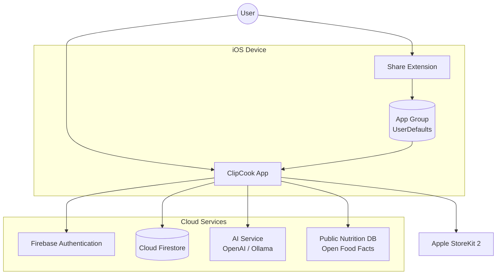

# 1. Introduction

## 1.1 Purpose

This document describes the software architecture of the **ClipCook** iOS application. It provides the technical blueprint for implementation, covering system structure, component design, data flow, integration points, security measures, and key architectural decisions. It translates the requirements from the SRS [2] into a buildable design.

## 1.2 Scope

ClipCook is an AI-powered iOS app for importing, organising, planning, and cooking recipes from Instagram Reels and other social media platforms. This AD covers:

- iOS client application (SwiftUI, iOS 17.0+)
- iOS Share Extension
- Firebase backend (Authentication + Firestore)
- AI integration (OpenAI / Ollama)
- Apple StoreKit 2 integration

**Not in scope for this version:** custom backend services, audio transcription pipeline, video processing.

## 1.3 Architectural Drivers

| Driver | Source | Impact |
|--------|--------|--------|
| AI recipe extraction for all users | CLAUDE.MD | AI service must be reliable and cost-effective at scale |
| Offline-first | SRS SYS-013 | Firestore offline persistence; no custom backend dependency for core flows |
| Premium via `isPremium` boolean | CLAUDE.MD | Simple premium gating; no feature flag infrastructure |
| Dutch UI, English code | CLAUDE.MD | String Catalogs for localisation; all code identifiers in English |
| iOS 17.0+ only | CLAUDE.MD | Enables `@Observable`, modern SwiftUI APIs, StoreKit 2 |

---

# 2. System Architecture

## 2.1 System Context



**Key characteristics:**
- The iOS app communicates directly with Firebase (no custom backend proxy)
- AI calls go directly from the client to OpenAI API (key stored in environment config, not hardcoded)
- Firestore provides both persistence and offline caching
- The Share Extension communicates with the main app exclusively via App Group shared storage

## 2.2 High-Level Architecture

```mermaid
graph LR
    subgraph "Presentation Layer"
        Views[SwiftUI Views]
    end

    subgraph "Business Logic Layer"
        VM[ViewModels<br/>@Observable + @MainActor]
    end

    subgraph "Data Access Layer"
        Repo[Repositories<br/>Protocol-based]
        Svc[Services<br/>Auth, Import, AI, Premium]
    end

    subgraph "External"
        FS[(Firestore)]
        AIAPI[AI API]
        LPMP[LPMetadataProvider]
        SK[StoreKit 2]
    end

    Views --> VM
    VM --> Repo
    VM --> Svc
    Repo --> FS
    Svc --> AIAPI
    Svc --> LPMP
    Svc --> SK
```

**Architectural pattern:** MVVM + Repository Pattern + Feature Modules

- **Views** are pure SwiftUI; they observe ViewModels and render UI
- **ViewModels** (`@Observable`, `@MainActor`) contain presentation logic and orchestrate services/repositories
- **Repositories** abstract Firestore CRUD behind protocols for testability
- **Services** encapsulate external integrations (Firebase Auth, AI, LinkPresentation, StoreKit)

---

# 3. Component Architecture

## 3.1 iOS Application Structure

```
ClipCook/
├── App/                          # AppDelegate, RootView, app lifecycle
├── Features/                     # Feature modules
│   ├── Auth/                     # SignInView + auth logic
│   ├── Onboarding/               # OnboardingView (3 slides)
│   ├── Home/                     # HomeView + HomeViewModel
│   ├── Import/                   # ImportView + ImportViewModel
│   ├── RecipeDetail/             # RecipeDetailView + RecipeDetailViewModel
│   ├── RecipeEdit/               # RecipeEditView + RecipeEditViewModel
│   ├── CookMode/                 # CookModeView + CookModeViewModel
│   ├── Shopping/                 # ShoppingListView + ShoppingListViewModel
│   ├── Planner/                  # MealPlannerView + MealPlannerViewModel
│   ├── Settings/                 # SettingsView + SettingsViewModel
│   └── Archived/                 # ArchivedRecipesView + ArchivedRecipesViewModel
├── Models/                       # Codable data models
├── Repositories/                 # Firestore repository protocols + implementations
├── Services/                     # External integration services
├── Shared/                       # Reusable components, extensions, MainTabView
│   └── Components/               # EmptyStateView, UndoToast, LinkPreviewCard, etc.
├── Theme/                        # AppTheme, ChefMascotView
└── Resources/                    # Assets, Localizable.xcstrings
```

Each feature module is self-contained with its own View and ViewModel. Features communicate through shared repositories and services, not directly with each other.

## 3.2 Feature Module Design

Each feature module follows this pattern:

```mermaid
graph TB
    View[FeatureView<br/>SwiftUI] --> ViewModel[FeatureViewModel<br/>@Observable @MainActor]
    ViewModel --> Repository[Repository<br/>Protocol]
    ViewModel --> Service[Service<br/>Protocol]
    Repository --> Firestore[(Firestore)]
    Service --> ExternalAPI[External API]
```

**Example — Import Feature:**

| Component | Responsibility |
|-----------|---------------|
| `ImportView` | URL input field, loading state, preview bottom sheet, error card |
| `ImportViewModel` | Orchestrates caption extraction → AI analysis → preview data |
| `CaptionExtractionService` | Extracts caption from URL (protocol-based, swappable implementation) |
| `RecipeAIExtractor` | Sends caption to AI model, returns `ParsedRecipe` |
| `RecipeRepository` | Persists recipe to Firestore |

## 3.3 Repositories

All Firestore data access flows through repository protocols:

| Repository | Firestore Path | Operations |
|------------|---------------|------------|
| `RecipeRepository` | `users/{userId}/recipes` | CRUD, archive/restore, favourites, filtered queries |
| `ShoppingListRepository` | `users/{userId}/shoppingItems` | CRUD, bulk import from recipe, clear checked |
| `MealPlanRepository` | `users/{userId}/mealSlots` | CRUD by date, nutrition aggregation |
| `UserRepository` | `users/{userId}` | Profile CRUD, preferences, premium status |
| `PendingImportRepository` | `users/{userId}/pendingImports` | Create from Share Extension, read on launch, delete after processing |

Repositories use `Codable` models for serialisation and real-time Firestore snapshot listeners for live data.

## 3.4 Services

| Service | Responsibility | External Dependency |
|---------|---------------|-------------------|
| `AuthService` | Firebase Auth lifecycle, Sign in with Apple, Google, Email | Firebase Auth SDK |
| `CaptionExtractionService` | Extract caption from social media URL | oEmbed API / embed parsing / scraping (protocol-based) |
| `RecipeAIExtractor` | Send caption to AI → receive structured `ParsedRecipe` | OpenAI API (prod) / Ollama (dev) |
| `ImportService` | Link metadata via `LPMetadataProvider` (title, thumbnail) | LinkPresentation framework |
| `PremiumService` | StoreKit 2 purchase flow, entitlement management | Apple StoreKit 2 |
| `NutritionDatabaseService` | Search public nutrition database for quick-add items | Open Food Facts / USDA API |

## 3.5 Share Extension


**Technical constraints:**
- SwiftUI-based extension UI (no UIKit storyboard)
- Accepts `public.url` and `public.text` UTTypes
- No `extensionContext.open(URL:)` (deprecated iOS 18)
- App Group container: `group.com.clipcook.app`
- `NSExtensionActivationSupportsWebURLWithMaxCount: 1`

---

# 4. Data Architecture

## 4.1 Firestore Data Model

```
users/{userId}                          # AppUser document
├── recipes/{recipeId}                  # Recipe subcollection
├── shoppingItems/{itemId}              # Shopping list items
├── mealSlots/{slotId}                  # Meal planner slots
└── pendingImports/{importId}           # Queued Share Extension imports
```

All data is scoped per user. There are no shared or global collections. See SRS Section 3 for complete attribute definitions.

## 4.2 Data Flow — Recipe Import


## 4.3 Offline Strategy

Firestore's built-in offline persistence (enabled by default on iOS) handles all offline scenarios:

- **Read:** Cached data served from local SQLite store
- **Write:** Mutations queued locally, synced when connectivity restores
- **Listeners:** Snapshot listeners fire with cached data immediately, then update with server data

No custom conflict resolution is needed for the initial release. Firestore uses last-write-wins for concurrent edits on the same document.

---

# 5. Integration Architecture

## 5.1 AI Integration


**Design decisions:**
- Direct API call from iOS client (no proxy server in initial release)
- API key stored via environment variable or build configuration (never hardcoded)
- Structured output (JSON mode) ensures consistent `ParsedRecipe` format
- 15-second timeout with graceful failure handling
- Ollama used during development (same prompt, local endpoint)

**`ParsedRecipe` schema:**

```swift
struct ParsedRecipe: Codable {
    let title: String
    let ingredients: [ParsedIngredient]
    let steps: [String]
    let nutrition: ParsedNutrition?
    let prepTime: String?
    let cookTime: String?
    let servings: Int?
}
```

## 5.2 Caption Extraction

The caption extraction strategy is abstracted behind a protocol:

```swift
protocol CaptionExtractionService {
    func extractCaption(from url: URL) async throws -> String
}
```

Candidate implementations (evaluated during development):
1. **Instagram oEmbed API** — official, limited data
2. **Embed page parsing** — parse HTML from embed endpoint
3. **Third-party scraping service** — most complete data, external dependency

The protocol abstraction allows swapping implementations without changing consumers.

## 5.3 Public Nutrition Database

Quick-add items in the meal planner are sourced from a public nutrition database:

```swift
protocol NutritionDatabaseService {
    func search(query: String) async throws -> [NutritionItem]
}
```

Candidate APIs: Open Food Facts (open-source, free), USDA FoodData Central (government, comprehensive). Results are cached locally for offline access and performance.

## 5.4 StoreKit 2 Integration


**Products:**
- Monthly subscription: €4.99/month with 1-week free trial
- Launch offer (first 2 weeks): lifetime access for €60

**Premium gating:** Views check `user.isPremium` boolean directly. No feature flag system.

---

# 6. Security Architecture

## 6.1 Authentication


- Firebase Auth manages all authentication flows
- Auth state persisted via `Auth.auth().addStateDidChangeListener`
- User profile created in Firestore on first login
- All Firestore queries are authenticated via Firebase ID token

## 6.2 Data Access Control

```
match /users/{userId} {
  allow read, write: if request.auth != null && request.auth.uid == userId;
  match /{subcollection}/{docId} {
    allow read, write: if request.auth != null && request.auth.uid == userId;
  }
}
match /{document=**} {
  allow read, write: if false;
}
```

Every user can only access their own data. No cross-user access is possible.

## 6.3 Secret Management

| Secret | Storage | Access |
|--------|---------|--------|
| Firebase config | `GoogleService-Info.plist` (not in public repos) | Build-time inclusion |
| OpenAI API key | Environment variable or Xcode build config | Runtime, never in source |
| Google Sign-In client ID | `GoogleService-Info.plist` | Build-time |

No secrets are embedded in the app binary. AI API keys are injected via build configuration or environment variables.

## 6.4 Network Security

- All communication over HTTPS (TLS 1.2+), enforced by Apple ATS
- Firebase SDK handles certificate pinning
- AI API calls use HTTPS with bearer token authentication

---

# 7. Quality Attributes

## 7.1 Performance

| Attribute | Target | Approach |
|-----------|--------|----------|
| App launch | < 1.5s | Minimal work in `AppDelegate`; lazy service initialisation |
| Frame rate | 60fps | `LazyVStack`/`LazyVGrid` for lists; image downsampling; stable `ForEach` identity |
| Screen load | < 300ms | Firestore snapshot listeners pre-fetch; cached images |
| AI response | < 15s | Timeout with graceful fallback; small model selection |
| Image bandwidth | Grid < 2MB/20 recipes | Thumbnails max 400px; uploads compressed to < 1MB |

## 7.2 Scalability

- **Firestore** auto-scales with usage; per-user subcollections avoid hot spots
- **OpenAI** scales via API; cost managed through rate limiting and small model selection
- **No custom backend** eliminates server management overhead for the initial release

## 7.3 Testability

| Layer | Testing Approach |
|-------|-----------------|
| ViewModels | Unit tests (XCTest) with mocked repository/service protocols |
| Repositories | Integration tests against Firebase Emulator Suite |
| Services | Unit tests with mocked HTTP responses |
| Views | Xcode Previews for visual verification; UI tests for critical flows |

Target: 70% unit test coverage for ViewModels, Repositories, and Services.

## 7.4 Accessibility

- SwiftUI semantic fonts (Dynamic Type)
- VoiceOver labels on all interactive elements
- Minimum 44pt tap targets
- Respect `accessibilityReduceMotion` for animations
- WCAG AA contrast ratios (4.5:1 normal, 3:1 large text)

---

# 8. Architecture Decisions

## ADR-001: Direct AI API Calls (No Backend Proxy)

**Context:** AI recipe extraction requires calling an LLM API. Options: (a) direct from iOS client, (b) via a backend proxy.

**Decision:** Direct API calls from iOS client for the initial release.

**Rationale:** Eliminates the need for a custom backend, reducing complexity and cost. API key is injected at build time, not hardcoded. When a backend is needed for audio transcription (future), the AI proxy can be added then.

**Risk:** API key in build config could be extracted from the binary. Mitigated by rate limiting on the API key and monitoring usage.

## ADR-002: No Feature Flags — isPremium Boolean

**Context:** Premium features need gating. Options: (a) per-feature flags in Firestore, (b) Firebase Remote Config, (c) single `isPremium` boolean.

**Decision:** Single `isPremium` boolean on the user document.

**Rationale:** Simpler implementation; fewer moving parts. All premium features unlock together. A/B testing is not needed for the initial release. Can be migrated to a more granular system later if needed.

## ADR-003: Protocol-Based Caption Extraction

**Context:** Instagram caption extraction methods may change or break. Options: (a) hardcode one method, (b) abstract behind protocol.

**Decision:** Service protocol with swappable implementations.

**Rationale:** Instagram's embed/API landscape changes frequently. The protocol abstraction allows switching from oEmbed to scraping to a third-party service without modifying the import flow.

## ADR-004: Firestore Direct (No Custom Backend)

**Context:** Options for data persistence: (a) Firebase direct from client, (b) custom backend (FastAPI/Node) proxying to Firestore.

**Decision:** Firestore accessed directly from the iOS client with security rules.

**Rationale:** Firebase's iOS SDK provides offline persistence, real-time sync, and authentication-based security rules out of the box. A custom backend adds latency, deployment complexity, and cost without benefit for the initial feature set.

## ADR-005: Feature Module Architecture

**Context:** Code organisation options: (a) type-based (all views together, all models together), (b) feature-based (each feature self-contained).

**Decision:** Feature-based module architecture with shared components.

**Rationale:** Each feature (Home, Import, RecipeDetail, etc.) is self-contained with its View + ViewModel. This improves code navigation, enables parallel development, and makes it easy to add or remove features. Shared components (EmptyStateView, ChefMascot, UndoToast) live in a common `Shared/` directory.

## ADR-006: @Observable over ObservableObject

**Context:** iOS 17+ enables the `@Observable` macro as a replacement for `ObservableObject`.

**Decision:** Use `@Observable` for all ViewModels. Mark with `@MainActor` for thread safety.

**Rationale:** `@Observable` provides more granular view updates (only affected properties trigger re-renders), simpler syntax (no `@Published` needed), and works with `@State` instead of `@StateObject`. Since the deployment target is iOS 17.0+, there's no need for backward compatibility.

---

# 9. Deployment Architecture

## 9.1 Environments

| Environment | Firebase Project | AI Endpoint | Purpose |
|------------|-----------------|-------------|---------|
| Development | `clipcook-dev` | Ollama (localhost) | Local development with Firebase Emulator Suite |
| Staging | `clipcook-staging` | OpenAI API (test key) | TestFlight builds, integration testing |
| Production | `clipcook-prod` | OpenAI API (prod key) | App Store release |

Firebase Emulator connection is gated behind `#if DEBUG` to prevent accidental production use.

## 9.2 Build & Release Pipeline

```
Developer → Git Push → CI (build + lint + test) → TestFlight → App Store
```

- **CI:** Build, SwiftLint (zero violations), XCTest (70% coverage target)
- **TestFlight:** Beta distribution for staging validation
- **App Store:** Production release with App Store Review

## 9.3 App Size Budget

Target: < 50MB thin download. Managed through:
- Asset catalog thinning
- No embedded ML models (AI is cloud-based)
- Minimal third-party dependencies (Firebase SDK + Google Sign-In)
