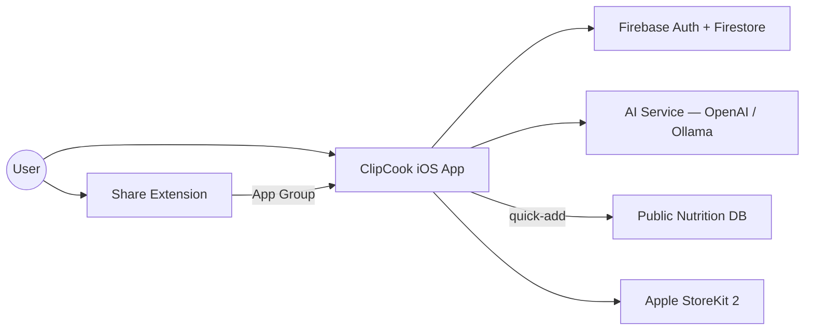

## References

| Ref | Title | Version |
|-----|-------|---------|
| [1] | CLAUDE.MD — ClipCook Project Specification | 1.0 |
| [2] | Apple App Store Review Guidelines | 2025 |
| [3] | Firebase Documentation — Firestore Security Rules | — |
| [4] | Apple StoreKit 2 Documentation | iOS 17+ |
| [5] | Open Food Facts API Documentation | — |

---

# 1. Introduction

## 1.1 Purpose

This document specifies the functional and non-functional requirements for the **ClipCook** iOS application. It serves as the primary reference for design, development, testing, and validation. The authoritative source for product direction is the `CLAUDE.MD` file [1]; this SRS translates that vision into verifiable requirements.

## 1.2 Scope

ClipCook is an AI-powered iOS app that lets users import, organise, plan, and cook recipes from Instagram Reels and other social media platforms. The app extracts captions (and optionally audio transcription in a future release) from shared links, analyses them with an AI model to produce structured recipes, and stores them in Firebase Firestore.

**In scope:**
- iOS App: SwiftUI, iOS 17.0+, distributed via Apple App Store
- Share Extension: SwiftUI-based, App Group data exchange
- Backend: Firebase Authentication + Cloud Firestore (offline persistence)
- AI: OpenAI (latest small model) for production, Ollama for local development
- Payments: Apple In-App Purchase (StoreKit 2)

**Out of scope (future):**
- Audio transcription backend (video download → Whisper speech-to-text)
- AI-powered automatic nutrition analysis from ingredients
- AI video-to-recipe conversion (TikTok/YouTube video parsing)
- AI meal plan generation

## 1.3 Definitions

| Term | Definition |
|------|------------|
| AI Recipe Extraction | Standard feature: AI analyses caption text to identify ingredients, steps, and nutrition |
| Premium | Paid subscription tier unlocking macro goal customisation and daily macro tracker |
| App Group | iOS shared container (`group.com.clipcook.app`) between the main app and Share Extension |
| Cook Mode | Full-screen step-by-step cooking guidance with timer |
| Macro Tracker | Daily nutrition tracking showing calories and macronutrient progress (premium) |
| Quick Add | Items from a public nutrition database added to the meal planner |
| PII | Personally Identifiable Information |

---

# 2. Functional Requirements

## 2.1 System Context



**Core flows:**
1. Import recipe from link (paste or Share Extension) → AI extraction → preview → save/edit
2. Manual creation and editing of recipes
3. View recipe detail with interactive cook mode
4. Manage shopping list (manual + recipe ingredient import)
5. Plan meals on a daily calendar with macro tracking (premium)
6. User preferences, subscription management, and account settings

**Screens:**

| # | Screen |
|---|--------|
| 1–3 | Onboarding slides: "Clip It", "Cook It", "Keep It" |
| 4 | Sign In (Apple, Google, Email) |
| 5 | Home — Recipe Grid |
| 6–8 | Import — Initial, Success Preview, Failure |
| 9 | Recipe Detail |
| 10 | Recipe Edit |
| 11 | Cook Mode |
| 12–13 | Shopping List — Empty, With Items |
| 14–17 | Meal Planner — Empty, Add Meal, With Meals, Premium Macro Tracker |
| 18–19 | Settings — Free, Premium |
| 20 | Archived Recipes |

---

## 2.2 Product Use Cases

### PUC-001 Onboarding & Sign-In

| Field | Value |
|-------|-------|
| **Trigger** | First app launch (no prior onboarding completion). |
| **Precondition** | App installed. |
| **Main Flow** | 1. System shows 3-slide onboarding (Clip It → Cook It → Keep It) with chef mascot.<br>2. User taps "Get Started" → navigates to Sign In.<br>3. User selects auth method: **Apple**, **Google**, or **Email/Password**.<br>4. System authenticates via Firebase Auth, creates user profile in Firestore, navigates to Home. |
| **Alt Flow** | A1: User taps "Skip" → goes directly to Sign In. |
| **Exc Flow** | E1: Auth fails → error message with retry. |

### PUC-002 Browse & Search Recipes

| Field | Value |
|-------|-------|
| **Trigger** | User navigates to Home tab. |
| **Precondition** | User is authenticated. |
| **Main Flow** | 1. System displays 2-column recipe grid (thumbnail, title, cook time, calorie/protein badges).<br>2. User searches by title (real-time filtering).<br>3. User taps category chip (All / Favourites / Breakfast / Lunch / Dinner / Snack).<br>4. User taps recipe → navigates to Recipe Detail. |
| **Alt Flow** | A1: No recipes → empty state with chef mascot and "Import Recipe" CTA.<br>A2: User taps heart icon → toggles favourite. |

### PUC-003 Import Recipe (AI-powered, standard for all users)

| Field | Value |
|-------|-------|
| **Trigger** | User taps "+" on Home, or shares a URL via Share Extension. |
| **Precondition** | User is authenticated. Internet connection available. |
| **Main Flow** | 1. System displays Import screen with URL field.<br>2. User pastes URL and taps "Import".<br>3. System extracts caption via best available method (oEmbed, embed parsing, scraping).<br>4. System sends caption to AI model → receives structured recipe (ingredients, steps, nutrition).<br>5. System shows preview bottom sheet with title, thumbnail, ingredients, steps.<br>6. User taps "Save as-is" → saved, navigates to Detail. Or "Edit & Save" → navigates to Edit. |
| **Alt Flow** | A1 (Share Extension): URL saved to App Group `pendingImports` → main app shows import modal on next launch.<br>A2: User taps "Cancel" → returns to Import screen. |
| **Exc Flow** | E1: Caption extraction or AI analysis fails → error card with "Try Again" and "Edit Manually" options. |

### PUC-004 View Recipe Detail

| Field | Value |
|-------|-------|
| **Trigger** | User taps a recipe card. |
| **Main Flow** | 1. Hero image with overlay buttons (back, favourite, edit, menu).<br>2. Recipe info card: title, prep time, cook time, servings adjuster (±).<br>3. Checkable ingredients list (strikethrough on tap).<br>4. Numbered steps with "Cook Mode" button.<br>5. Expandable nutrition panel (calorie ring + macro bars). |
| **Alt Flow** | A1: "Edit" → Recipe Edit. A2: "Cook Mode" → Cook Mode. A3: Menu → Archive or Delete. |
| **Exc Flow** | E1: Delete/Archive → 5-second undo toast. |

### PUC-005 Edit / Create Recipe

| Field | Value |
|-------|-------|
| **Trigger** | User taps "Edit" on Detail, or "Edit & Save" / "Edit Manually" from Import. |
| **Main Flow** | 1. Edit form: photo picker, title, prep/cook time, servings.<br>2. Ingredients: add/remove/reorder with drag handles.<br>3. Steps: add/remove/reorder with drag handles.<br>4. Nutrition: manual input (calories, protein, carbs, fats).<br>5. "Save" → celebration animation → navigates to Detail. |
| **Exc Flow** | E1: Back without saving → changes discarded. |

### PUC-006 Cook Mode

| Field | Value |
|-------|-------|
| **Trigger** | User taps "Cook Mode" on Recipe Detail. |
| **Precondition** | Recipe has at least one step. |
| **Main Flow** | 1. Full-screen interface: step number, progress bar, step text.<br>2. Timer (start/pause/reset) per step.<br>3. "Done — Next Step" advances; Previous/Next buttons available.<br>4. Screen stays awake (idle timer disabled).<br>5. Final step: "Finish Recipe" → completion toast → return to Detail. |
| **Alt Flow** | A1: App backgrounded → local notification at timer expiry. |

### PUC-007 Shopping List

| Field | Value |
|-------|-------|
| **Trigger** | User navigates to Shopping tab. |
| **Main Flow** | 1. Add items manually via text field.<br>2. Import ingredients from saved recipes via quick-add chips.<br>3. Check off items (strikethrough).<br>4. "Clear checked" removes all checked items. |
| **Alt Flow** | A1: Empty list → chef mascot empty state with recipe suggestion chips. |

### PUC-008 Meal Planning

| Field | Value |
|-------|-------|
| **Trigger** | User navigates to Planner tab. |
| **Main Flow** | 1. Daily view with date navigation (arrows, calendar, swipe).<br>2. 6 meal slots: Breakfast, Morning Snack, Lunch, Afternoon Snack, Dinner, Evening Snack.<br>3. "+" opens bottom sheet: "Recipes" tab (saved recipes) or "Quick Add" tab (items from public nutrition database).<br>4. User selects item → chooses meal slot → added to day.<br>5. Meals displayed grouped by type with nutrition summary. |
| **Alt Flow** | A1 (Free): Macro tracker area shows locked premium upsell banner.<br>A2 (Premium): Daily calorie progress bar + circular macro gauges with goal tracking. |

### PUC-009 Subscription & Premium

| Field | Value |
|-------|-------|
| **Trigger** | User taps "Upgrade to Premium" in Settings or locked feature elsewhere. |
| **Precondition** | User is authenticated; StoreKit products configured. |
| **Main Flow** | 1. Premium modal: chef mascot, feature list, pricing.<br>2. User taps CTA → Apple IAP flow.<br>3. Success → `isPremium` set to true, premium badge in Settings.<br>4. Premium unlocks: custom nutrition goals, macro tracker in planner, expanded reporting. |
| **Pricing** | Free trial: 1 week. Monthly: €4.99/month. **Launch offer** (first 2 weeks post-release): lifetime access for €60. |
| **Important** | AI recipe extraction is **standard for all users**, not premium-gated. |
| **Alt Flow** | A1: "Maybe later" → dismissed. A2: "Restore Purchases" in Settings. |
| **Exc Flow** | E1: Purchase fails → error with retry. |

### PUC-010 Settings & Preferences

| Field | Value |
|-------|-------|
| **Trigger** | User navigates to Settings tab. |
| **Main Flow** | 1. Profile card (name, email, premium badge).<br>2. Preferences: dark mode toggle, units (metric/imperial).<br>3. Nutrition goals (premium): calorie slider, macro sliders with auto-redistribution.<br>4. Library: archived recipes (with count).<br>5. Subscription: manage, restore purchases.<br>6. Account: change email, change password.<br>7. Legal: privacy policy, terms of service.<br>8. About: app name and version.<br>9. Danger zone: log out, delete account. |

### PUC-011 Archive & Restore Recipes

| Field | Value |
|-------|-------|
| **Trigger** | User taps "Archive" on Recipe Detail, or "Archived Recipes" in Settings. |
| **Main Flow** | 1. Archived list: thumbnail, title, cook time, calories.<br>2. Restore button → moves back to active collection (undo toast).<br>3. Delete button → permanent removal (undo toast). |
| **Alt Flow** | A1: No archived recipes → empty state with chef mascot. |

---

## 2.3 System Requirements

### SYS-001 Onboarding Flow

| Acceptance Criteria | TC |
|--------------------|----|
| 3 slides with chef mascot: "Clip It", "Cook It", "Keep It" | TC-001 |
| "Skip" on slides 1–2 navigates to Sign In | TC-002 |
| "Get Started" on slide 3 navigates to Sign In | TC-003 |
| Onboarding not shown after completion | TC-004 |

### SYS-002 Recipe Collection Browsing

| Acceptance Criteria | TC |
|--------------------|----|
| 2-column grid with thumbnail, title, cook time, calorie/protein badges | TC-010 |
| Real-time search by title | TC-011 |
| Category chips: All, Favourites, Breakfast, Lunch, Dinner, Snack | TC-012 |
| Heart icon toggles favourite | TC-014 |
| Empty state with chef mascot and "Import Recipe" CTA | TC-015 |

### SYS-003 AI Recipe Import (standard for all users)

| Acceptance Criteria | TC |
|--------------------|----|
| URL input validates and accepts links | TC-020 |
| Caption extracted via best available method (oEmbed, embed parsing, scraping) | TC-021 |
| AI model analyses caption → structured recipe (ingredients, steps, nutrition) | TC-022 |
| Success preview: title, thumbnail, ingredients, steps | TC-023 |
| "Save as-is" and "Edit & Save" both work | TC-024 |
| Failure: error card with "Try Again" and "Edit Manually" | TC-025 |
| Supported platforms: Instagram, TikTok, YouTube, generic websites | TC-026 |
| Share Extension writes to App Group `pendingImports` | TC-027 |
| Pending imports shown on app launch | TC-028 |

### SYS-004 Recipe Detail View

| Acceptance Criteria | TC |
|--------------------|----|
| Hero image with gradient overlay and action buttons | TC-030 |
| Servings adjuster (±) | TC-031 |
| Checkable ingredients (strikethrough) | TC-032 |
| Numbered steps with "Cook Mode" button | TC-033 |
| Expandable nutrition panel (calorie ring, macro bars) | TC-035 |
| Menu: Archive and Delete with 5-second undo toast | TC-036 |

### SYS-005 Recipe Editing

| Acceptance Criteria | TC |
|--------------------|----|
| Photo upload/replace via PhotosPicker | TC-040 |
| All fields editable: title, prep/cook time, servings | TC-041 |
| Ingredients: add, remove, reorder (drag handles) | TC-042 |
| Steps: add, remove, reorder (drag handles) | TC-043 |
| Nutrition: manual input (calories, protein, carbs, fats) | TC-044 |
| Save triggers celebration animation | TC-045 |

### SYS-006 Cook Mode

| Acceptance Criteria | TC |
|--------------------|----|
| Progress bar and "Step N of M" indicator | TC-050 |
| Timer: start, pause, reset per step | TC-052 |
| "Done — Next Step" advances; Previous/Next navigation | TC-053 |
| Screen stays awake (`isIdleTimerDisabled = true`) | TC-054 |
| Local notification on timer expiry when backgrounded | TC-055 |
| "Finish Recipe" on final step → completion toast | TC-056 |

### SYS-007 Authentication

| Acceptance Criteria | TC |
|--------------------|----|
| Sign in with Apple creates Firebase user | TC-060 |
| Google Sign-In creates Firebase user | TC-061 |
| Email/Password sign-in creates Firebase user | TC-062 |
| Auth state persisted across launches | TC-063 |
| User profile created in Firestore on first login | TC-064 |

### SYS-008 Shopping List

| Acceptance Criteria | TC |
|--------------------|----|
| Free-text item entry | TC-070 |
| Recipe ingredient import with recipe name attribution | TC-071 |
| Checkable items with strikethrough | TC-072 |
| "Clear checked" removes checked items | TC-073 |
| Recipe quick-add chips for fast import | TC-074 |
| Data persists via Firestore | TC-075 |

### SYS-009 Meal Planner

| Acceptance Criteria | TC |
|--------------------|----|
| Date navigation: arrows, calendar picker, swipe | TC-080 |
| "Today" shortcut when viewing another date | TC-081 |
| Add meal: bottom sheet with Recipes / Quick Add tabs | TC-082 |
| Quick Add items sourced from public nutrition database | TC-083 |
| 6 meal slots per day | TC-084 |
| Meals grouped by type with nutrition summary | TC-085 |
| Meals removable via X button | TC-086 |
| Free: locked macro tracker with premium upsell | TC-087 |
| Premium: calorie bar + circular macro gauges with goals | TC-088 |

### SYS-010 Premium Subscription (StoreKit 2)

| Acceptance Criteria | TC |
|--------------------|----|
| Premium modal: feature list, €4.99/month pricing | TC-090 |
| Launch offer: lifetime €60 (first 2 weeks post-release) | TC-091 |
| Free trial: 1 week | TC-092 |
| StoreKit purchase activates premium (`isPremium = true`) | TC-093 |
| Restore Purchases restores entitlements | TC-094 |
| AI recipe extraction remains available to free users | TC-095 |

### SYS-011 User Preferences

| Acceptance Criteria | TC |
|--------------------|----|
| Dark mode toggle switches theme; preference stored in Firestore | TC-100 |
| Units toggle (metric/imperial) persists | TC-101 |
| Nutrition goals (premium): calorie slider, macro sliders | TC-102 |
| Macro auto-redistribution: adjusting calories recalculates macros by percentage | TC-103 |
| Adjusting one macro redistributes remaining between other two | TC-104 |
| Conversion: 1g protein = 4 kcal, 1g carbs = 4 kcal, 1g fats = 9 kcal | TC-105 |

### SYS-012 Recipe Archival

| Acceptance Criteria | TC |
|--------------------|----|
| Archive moves recipe to archived collection (soft delete) | TC-110 |
| Restore moves recipe back to active collection | TC-111 |
| Permanent delete removes recipe | TC-112 |
| 5-second undo toast on archive/delete/restore | TC-113 |
| Archived recipe count shown in Settings | TC-114 |

### SYS-013 Offline Support

| Acceptance Criteria | TC |
|--------------------|----|
| All CRUD operations work offline via Firestore offline persistence | TC-120 |
| Data syncs when connectivity is restored | TC-121 |

### SYS-014 Share Extension

| Acceptance Criteria | TC |
|--------------------|----|
| Accepts `public.url` and `public.text` content types | TC-130 |
| Writes to App Group `pendingImports` with schema: `{id, type, content, createdAt, sourceApp}` | TC-131 |
| Confirmation shown to user in extension | TC-132 |
| Main app reads pending imports on launch | TC-133 |

---

## 2.4 Detailed System Requirements

### SYS-003.1 Caption Extraction Strategy

The system shall extract Instagram captions via the best available method, evaluated during development: Instagram oEmbed API, embed page parsing, or third-party scraping service. The implementation shall be abstracted behind a service protocol to allow swapping methods without changing consumers.

### SYS-003.2 AI Extraction Pipeline

The system shall send extracted caption text to an AI model (OpenAI latest small model in production, Ollama locally) with a structured output schema. The AI shall return a `ParsedRecipe` with: title, ingredients (name, amount), steps (ordered text), estimated nutrition (calories, protein, carbs, fats), prep time, cook time, and servings. If the AI cannot extract a recipe, the system shall return a failure result.

### SYS-003.3 Import Failure Recovery

When extraction or AI analysis fails, the system shall offer: (a) "Try Again" to retry, (b) "Edit Manually" to create a blank recipe shell with the source URL preserved.

### SYS-009.1 Public Nutrition Database Integration

The Quick Add feature in the meal planner shall source items from a public nutrition database (e.g., Open Food Facts [5] or USDA FoodData Central). Users can search for food items and add them to meal slots with accurate nutrition data. The app shall cache frequently used items locally.

### SYS-009.2 Daily Macro Tracker (Premium)

When `isPremium` is true, the meal planner displays: (a) total calorie progress bar (turns red when exceeding goal), (b) circular gauges for protein, carbs, and fats relative to the user's nutrition goals.

### SYS-011.1 Nutrition Goal Auto-Calculation

When the user adjusts the daily calorie goal, macros redistribute by percentage (default: 30% protein / 40% carbs / 30% fats). When adjusting a single macro, remaining calories redistribute proportionally between the other two.

---

# 3. Data Requirements

## DATA-001 User (`users/{userId}`)

| Attribute | Type | Constraints |
|-----------|------|-------------|
| id | string | Required, Firebase Auth UID |
| email | string | Required, valid email |
| displayName | string | Optional |
| units | enum | "metric" \| "imperial", default "metric" |
| darkMode | boolean | Default false |
| isPremium | boolean | Default false |
| nutritionGoals | NutritionGoals | Embedded sub-document |
| schemaVersion | integer | Required |
| createdAt | timestamp | Auto-set |
| updatedAt | timestamp | Auto-updated |

**Relationships:** Has many Recipes, ShoppingItems, MealSlots, PendingImports.

## DATA-002 Recipe (`users/{userId}/recipes/{recipeId}`)

| Attribute | Type | Constraints |
|-----------|------|-------------|
| id | string | Required |
| title | string | Required, max 200 chars |
| thumbnail | string? | Photo URL or local path |
| sourceUrl | string? | Original import URL |
| sourcePlatform | enum? | "instagram" \| "tiktok" \| "youtube" \| null |
| caption | string? | Original post caption |
| prepTime | string? | e.g. "10 min" |
| cookTime | string? | e.g. "25 min" |
| servings | integer | Required, min 1 |
| category | enum | "Breakfast" \| "Lunch" \| "Dinner" \| "Snack" |
| ingredients | Ingredient[] | Array of `{id, name, amount, notes?}` |
| steps | Step[] | Array of `{id, order, text}` |
| nutrition | Nutrition? | `{calories, protein, carbs, fats}` (all integers >= 0) |
| aiMeta | map? | AI model version, extraction timestamp |
| isArchived | boolean | Default false |
| isFavourite | boolean | Default false |
| createdAt | timestamp | Auto-set |
| updatedAt | timestamp | Auto-updated |

## DATA-003 ShoppingItem (`users/{userId}/shoppingItems/{itemId}`)

| Attribute | Type | Constraints |
|-----------|------|-------------|
| id | string | Required |
| name | string | Required |
| recipeId | string? | FK to Recipe |
| recipeName | string? | Display reference |
| checked | boolean | Default false |

## DATA-004 MealSlot (`users/{userId}/mealSlots/{slotId}`)

| Attribute | Type | Constraints |
|-----------|------|-------------|
| id | string | Required |
| day | string | "yyyy-MM-dd" |
| meal | enum | "Breakfast" \| "Morning Snack" \| "Lunch" \| "Afternoon Snack" \| "Dinner" \| "Evening Snack" |
| recipeId | string? | FK to Recipe |
| quickAdd | QuickAddItem? | `{name, calories, protein, carbs, fats}` |
| createdAt | timestamp | Auto-set |

## DATA-005 PendingImport (`users/{userId}/pendingImports/{importId}`)

| Attribute | Type | Constraints |
|-----------|------|-------------|
| id | string | Required |
| url | string | Required |
| status | enum | "importing" \| "ready" \| "failed" |
| title | string? | Extracted title |
| thumbnail | string? | Extracted image URL |
| caption | string? | Extracted caption |
| createdAt | timestamp | Auto-set |

## DATA-006 NutritionGoals (embedded in User)

| Attribute | Type | Constraints |
|-----------|------|-------------|
| calories | integer | 1200–4000, default 2200 |
| protein | integer | >= 0, default 120g |
| carbs | integer | >= 0, default 250g |
| fats | integer | >= 0, default 70g |

## Firestore Security Rules

Users can only read and write their own data:

```
rules_version = '2';
service cloud.firestore {
  match /databases/{database}/documents {
    match /users/{userId} {
      allow read, write: if request.auth != null && request.auth.uid == userId;
      match /{subcollection}/{docId} {
        allow read, write: if request.auth != null && request.auth.uid == userId;
      }
    }
    match /{document=**} {
      allow read, write: if false;
    }
  }
}
```

---

# 4. Non-Functional Requirements

## 4.1 Security

| ID | Requirement | Fit Criteria |
|----|------------|--------------|
| SEC-001 | All network communication via TLS 1.2+ (HTTPS) | No HTTP requests in production; Apple ATS enforced |
| SEC-002 | Firestore rules enforce `request.auth.uid == userId` | Rules tested in emulator; peer-reviewed before deploy |
| SEC-003 | API keys and secrets never in client code or repository | CI secret scanning passes; AI keys server-side or env vars |
| SEC-004 | IAP receipts validated server-side before granting premium | No premium access without validated receipt |
| SEC-005 | AI endpoint rate limiting to prevent abuse | HTTP 429 returned when thresholds exceeded |

## 4.2 Look and Feel

| ID | Requirement | Fit Criteria |
|----|------------|--------------|
| LOOK-001 | SF system fonts, system colours, consistent spacing (16pt border radius) | Design review across all screens |
| LOOK-002 | Light & Dark mode via SwiftUI semantic colours; toggle in Settings | All screens correct in both modes; no hardcoded colours |
| LOOK-003 | Chef mascot appears in: onboarding, sign-in, loading, errors, empty states, celebrations | Mascot present in all listed contexts |

## 4.3 Usability

| ID | Requirement | Fit Criteria |
|----|------------|--------------|
| USE-001 | Dynamic Type, VoiceOver, min 44pt tap targets | VoiceOver audit passes; no target below 44pt |
| USE-002 | Swipe gestures for planner date nav and cook mode step nav | Horizontal swipe >50pt threshold navigates |
| USE-003 | 5-second undo toast on all destructive actions | Toast with "Undo" button; tapping reverses action |
| USE-004 | Screen stays awake during Cook Mode | `isIdleTimerDisabled = true` on entry, restored on exit |
| USE-005 | Respect iOS "Reduce Motion" setting | No spring/slide animations when enabled; fade/instant only |

## 4.4 Performance

| ID | Requirement | Fit Criteria |
|----|------------|--------------|
| PERF-001 | App launch < 1.5s to first meaningful screen | 95th percentile on iPhone 14 or equivalent |
| PERF-002 | 60fps during scrolling, animations, transitions | Instruments profiling shows no sustained drops |
| PERF-003 | Screen loads < 300ms for cached data | Tap to full render measured via traces |
| PERF-004 | AI extraction timeout: 15 seconds with fallback | After timeout, graceful error with retry option |
| PERF-005 | Images: lazy-loaded, cached. Grid thumbnails max 400px, detail max 1200px, uploads max 1MB | Memory stable during 100+ recipe scroll |
| PERF-006 | Local notification on Cook Mode timer expiry when backgrounded | Fires within 1s of timer completion |

## 4.5 Operational

| ID | Requirement | Fit Criteria |
|----|------------|--------------|
| OPER-001 | CI pipeline: build + lint (SwiftLint) + unit tests on every PR | PR blocked if CI fails; < 10 min runtime |
| OPER-002 | App binary < 50MB (thin download) | App Store Connect size report per release |

## 4.6 Maintainability

| ID | Requirement | Fit Criteria |
|----|------------|--------------|
| MAIN-001 | SwiftLint enforced; 70% test coverage for ViewModels, Repositories, Services | Zero lint violations; coverage report verified |
| MAIN-002 | Schema versioning via `schemaVersion` on User docs | Migration tests cover all version transitions |

## 4.7 Logging

| ID | Requirement | Fit Criteria |
|----|------------|--------------|
| LOG-001 | Errors/crashes via Firebase Crashlytics; no PII in logs | Crash-free sessions > 99% |
| LOG-002 | `os.Logger` for client logging; no `print()` in production | Code review enforced |

## 4.8 Compliance

| ID | Requirement | Fit Criteria |
|----|------------|--------------|
| COMP-001 | GDPR: data export (JSON) + account deletion within 30 days; privacy policy in-app | Functional tested |
| COMP-002 | Apple App Store: all premium features via IAP only; accurate feature descriptions | App Review passes |
| COMP-003 | WCAG AA: 4.5:1 contrast (normal), 3:1 (large); full VoiceOver | Accessibility audit passes |
| COMP-004 | All user-facing strings in `.xcstrings` String Catalogs; initial release: Dutch (nl) | Zero hardcoded strings in Swift source |

---

# 5. Future Features (Out of Scope)

The following features are planned for post-launch releases. They are documented here for architectural awareness but are **not** requirements for the initial release.

| Feature | Description | Backend Required |
|---------|-------------|-----------------|
| Audio Transcription | Download Instagram Reel video → extract audio → Whisper speech-to-text → feed to AI alongside caption | Yes (video download + Whisper API) |
| AI Nutrition Analysis | Automatic macro calculation from ingredient list | No (direct API call) |
| AI Video-to-Recipe | Parse TikTok/YouTube videos for recipe content | Yes (video processing) |
| AI Meal Planner | Auto-generate weekly meal plans based on preferences and goals | No (direct API call) |

---

# Appendix A: Traceability Matrix

| Product UC | System Req | Data Entity | Test Cases |
|------------|------------|-------------|------------|
| PUC-001 | SYS-001, SYS-007 | DATA-001 | TC-001..004, TC-060..064 |
| PUC-002 | SYS-002 | DATA-002 | TC-010..015 |
| PUC-003 | SYS-003, SYS-014 | DATA-002, DATA-005 | TC-020..028, TC-130..133 |
| PUC-004 | SYS-004 | DATA-002 | TC-030..036 |
| PUC-005 | SYS-005 | DATA-002 | TC-040..045 |
| PUC-006 | SYS-006 | DATA-002 | TC-050..056 |
| PUC-007 | SYS-008 | DATA-003 | TC-070..075 |
| PUC-008 | SYS-009 | DATA-004, DATA-006 | TC-080..088 |
| PUC-009 | SYS-010 | DATA-001 | TC-090..095 |
| PUC-010 | SYS-011 | DATA-001, DATA-006 | TC-100..105 |
| PUC-011 | SYS-012 | DATA-002 | TC-110..114 |
| — | SYS-013 | All | TC-120..121 |

# Appendix B: Glossary

| Term | Definition |
|------|------------|
| ClipCook | The iOS recipe management and meal planning application |
| Recipe | A stored cooking recipe with ingredients, steps, and metadata |
| Share Extension | iOS extension allowing URL sharing from other apps to ClipCook |
| App Group | iOS shared container between main app and Share Extension |
| Meal Slot | A position in the daily meal plan (e.g., Breakfast, Dinner) |
| Quick Add | Food item from public nutrition database added to meal planner |
| Cook Mode | Full-screen step-by-step cooking guidance with timer |
| Macro Tracker | Premium daily nutrition tracking (calories + protein/carbs/fats progress) |
| isPremium | Boolean on user document controlling access to premium features |

# Appendix C: Risks & Mitigations

| Risk ID | Risk | Impact | Likelihood | Mitigation |
|---------|------|--------|------------|------------|
| RISK-001 | Share Extension inconsistent across iOS versions | High | Medium | Test on real devices across iOS 17–18 |
| RISK-002 | App Store rejection (payment/AI claims) | High | Low | IAP exclusive; accurate feature descriptions |
| RISK-003 | Firestore security rules misconfigured | Critical | Low | Test in emulator; peer-review all changes |
| RISK-004 | Subscription fraud via receipt manipulation | Medium | Low | Server-side receipt validation |
| RISK-005 | Instagram caption extraction blocked/changed | High | Medium | Abstracted service protocol; multiple extraction methods |
| RISK-006 | AI model costs exceed budget at scale | Medium | Medium | Rate limiting; cost monitoring; model size optimisation |
| RISK-007 | Public nutrition database unavailability | Low | Low | Local caching of frequently used items; graceful fallback |
